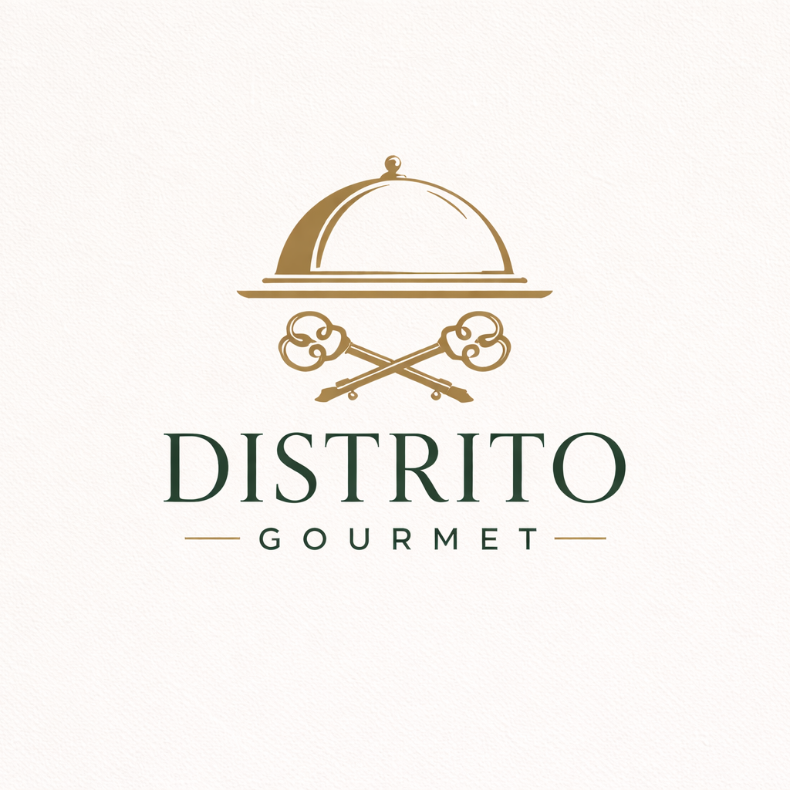

<p align="center">
  
</p>

<h1 align="center">Distrito Gourmet</h1>
<p align="center"><i>Plataforma headless de gestión gastronómica para restaurantes de alta cocina</i></p>

<p align="center">
  
  
  
  
  
  
  
</p>

---

## 📑 Índice

- [¿Qué es Distrito Gourmet?](#-qué-es-distrito-gourmet)
- [¿Qué ofrece la plataforma?](#-qué-ofrece-la-plataforma)
- [Stack tecnológico](#-stack-tecnológico)
- [Estructura del proyecto](#️-estructura-del-proyecto)
- [Documentación detallada](#-documentación-detallada)
- [Instalación rápida con Docker](#️-instalación-rápida-con-docker)
- [Validación de entrega](#-validación-de-entrega)
- [Autor](#-autor)

---

## 🧭 ¿Qué es Distrito Gourmet?

**Distrito Gourmet** es una plataforma web integral diseñada para transformar la gestión digital de restaurantes de alta cocina.

A diferencia de las plataformas genéricas de terceros, esta solución devuelve la **soberanía tecnológica y de datos** al restaurador:

- 🚫 **Cero comisiones** por reserva o pedido.
- 🔐 **Datos de clientes 100% propios**, sin intermediarios.
- 🎨 **Experiencia de usuario a medida**, totalmente adaptada a la identidad visual del local.

---

## ✨ ¿Qué ofrece la plataforma?

La aplicación se divide en dos grandes experiencias diseñadas para maximizar la eficiencia operativa y la satisfacción del cliente:

| Ámbito | 👤 Experiencia para el Comensal | 🔐 Gestión para el Restaurador |
|---|---|---|
| **Carta** | Carta gastronómica interactiva con filtrado avanzado por alérgenos y categorías | Panel de administración real-time para editar carta, precios y disponibilidad |
| **Maridaje** | Sommelier digital: recomendaciones de vino integradas en cada plato | Gestión de bodega y control de stock |
| **Menús degustación** | Visualización clara de menús estructurados por pasos | Herramienta única para estructurar menús degustación por pasos y tiempos |
| **Reservas** | Motor de reservas en tiempo real: elección de mesa y menú deseado | Control de aforo inteligente (44 comensales) por franjas horarias |
| **Pedidos** | Pedidos online (takeaway) con carrito reactivo y notificaciones de estado | Acceso directo a la base de datos de clientes y métricas de consumo |

---

## 🚀 Stack tecnológico

El proyecto utiliza una arquitectura **headless (desacoplada)** de última generación:

| Capa | Tecnología | Propósito |
|---|---|---|
| Frontend | [React 19](https://react.dev/) + [Vite](https://vitejs.dev/) + [Zustand](https://zustand-demo.pmnd.rs/) | SPA de alto rendimiento |
| Backend | [Laravel 12](https://laravel.com/) | API RESTful segura con Sanctum |
| Animaciones | [GSAP](https://gsap.com/) | Navegación fluida y estética "gourmet" |
| Infraestructura | [Docker](https://www.docker.com/) & [Docker Compose](https://docs.docker.com/compose/) | Despliegue consistente en local y producción |

---

## 🗂️ Estructura del proyecto

```
distrito-gourmet/
├── frontend/              # SPA en React + Vite
│   ├── public/
│   │   └── favicon.png
│   └── src/
├── backend/               # API en Laravel 12
│   ├── app/
│   └── routes/
├── docs/
│   ├── DEPLOY.md
│   ├── MANUAL_USUARIO.md
│   └── API_DOCS.md
├── Documentacion.md
├── docker-compose.yml
└── README.md
```

> Nota: este árbol es orientativo a partir de las rutas mencionadas en el resto de la documentación; ajústalo si la estructura real de tu repositorio difiere.

---

## 📖 Documentación detallada

Para profundizar en los aspectos técnicos o manuales de uso, consulta:

| Documento | Contenido |
|---|---|
| [📐 Documentación técnica](./Documentacion.md) | Decisiones de diseño, patrones y estructura del código |
| [🚀 Guía de despliegue](./docs/DEPLOY.md) | Instalación local y en producción (Docker/Homelab) |
| [📘 Manual de usuario](./docs/MANUAL_USUARIO.md) | Guía paso a paso para clientes y administradores |
| [🔌 Documentación de la API](./docs/API_DOCS.md) | Endpoints, autenticación y esquemas de datos |

---

## 🛠️ Instalación rápida con Docker

### Requisitos previos

- [Docker](https://www.docker.com/) y [Docker Compose](https://docs.docker.com/compose/) instalados
- Git

### Pasos

```bash
# 1. Clonar el repositorio
git clone https://github.com/AVL05/distrito-gourmet.git
cd distrito-gourmet

# 2. Crear configuración base
cp backend/.env.example backend/.env
cp frontend/.env.example frontend/.env

# 3. Levantar el entorno completo
docker-compose up -d --build

# 4. Inicializar base de datos y datos de prueba
docker exec -it distrito-backend php artisan migrate --seed
```

La aplicación quedará disponible según los puertos configurados en `docker-compose.yml`. Consulta la [guía de despliegue](./docs/DEPLOY.md) para más detalle sobre configuración en producción.

---

## ✅ Validación de entrega

```bash
# Frontend
npm --prefix frontend run lint
npm --prefix frontend run build

# Backend
cd backend && php artisan test
cd backend && php artisan route:list --path=api
```

**Smoke test manual recomendado:**
carta → carrito → pedido takeaway → reserva → login → perfil → dashboard → panel de administración.

---

## 👨‍💻 Autor

**Alex Vicente Lopez**
Proyecto de Fin de Ciclo (PFC) · IES Serra Perenxisa · 2025-2026

<p align="center">
  
</p>
