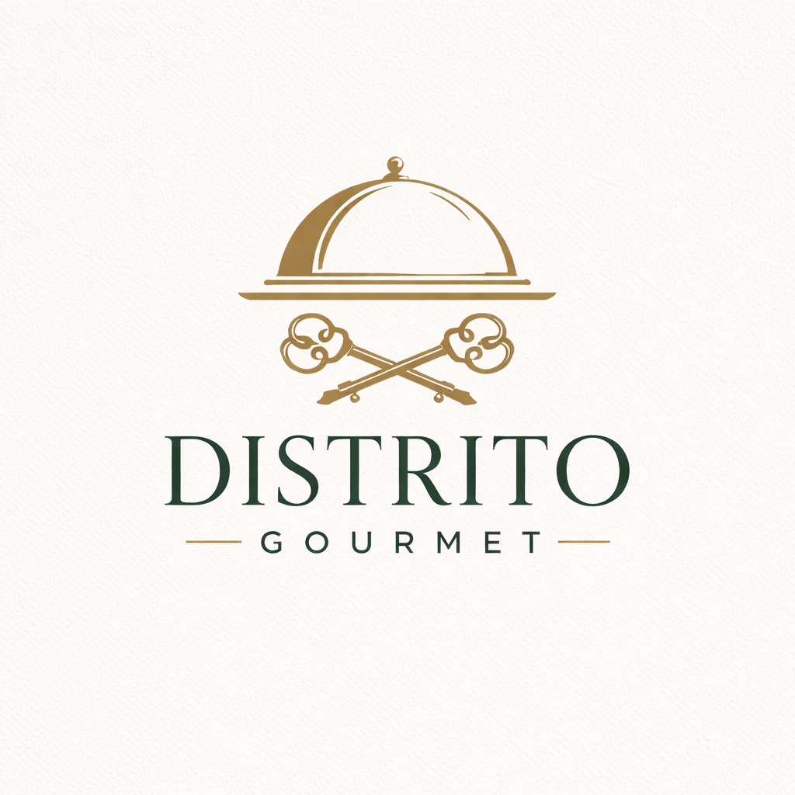
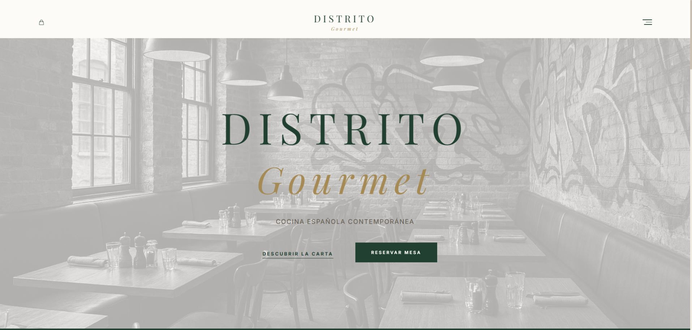
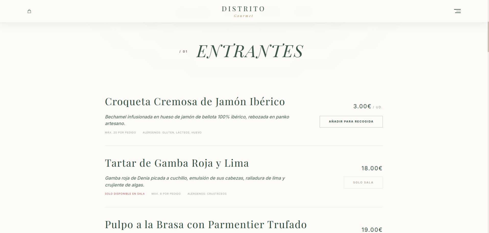
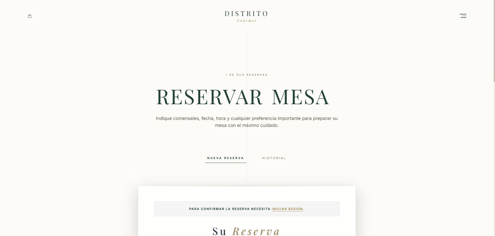
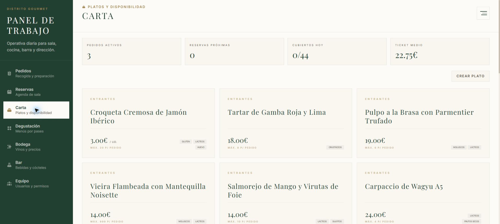
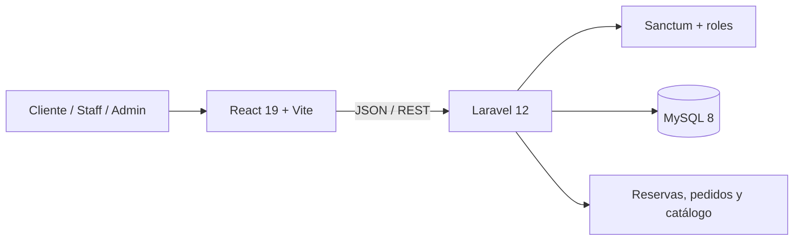

<p align="center">
  
</p>

<h1 align="center">Distrito Gourmet</h1>

<p align="center">
  Plataforma full-stack para centralizar la experiencia del comensal y la operativa diaria de un restaurante.
</p>

<p align="center">
  <a href="https://distrito.aleviclop.dev/"><strong>Ver demo</strong></a>
  ·
  <a href="./docs/MANUAL_USUARIO.md"><strong>Manual de usuario</strong></a>
  ·
  <a href="./docs/API_DOCS.md"><strong>API</strong></a>
</p>

<p align="center">
  
  
  
  
  
  
</p>



## El producto

Distrito Gourmet es una aplicación web desacoplada que reúne en un único sistema la carta digital, las reservas, los pedidos para recoger y la gestión interna del restaurante.

El proyecto nace para resolver un problema habitual: la experiencia pública y la operativa del equipo suelen depender de herramientas distintas, plataformas con comisiones y datos fragmentados. La solución mantiene el control de clientes, catálogo, reservas y pedidos dentro de una arquitectura propia.

### Qué demuestra

- Diseño e implementación de un producto completo, no solo una landing page.
- SPA responsive con navegación, estado global, animaciones y flujos autenticados.
- API REST con reglas de negocio, validación, roles y persistencia relacional.
- Separación entre experiencia de cliente, operativa de staff y administración.
- Arranque local unificado y despliegue reproducible mediante Docker Compose.

## Recorrido visual

### Carta digital y pedidos para recoger

La carta organiza platos, bebidas, vinos y menús de degustación. Cada artículo expone precio, alérgenos, disponibilidad y límites por pedido.



### Reservas

El formulario guía la selección de comensales, fecha y turno, consulta disponibilidad y resume los datos antes de confirmar.



### Panel de trabajo

El panel interno reúne métricas y herramientas para pedidos, reservas, carta, degustación, bodega, bebidas y permisos de usuarios.



## Funcionalidades

| Área | Cliente | Staff y administración |
| --- | --- | --- |
| Carta | Consulta de platos, bebidas, vinos y menús | Alta, edición, disponibilidad, alérgenos y eliminación |
| Reservas | Disponibilidad por fecha, turno y comensales | Agenda, confirmación, cancelación y control de ocupación |
| Pedidos | Carrito, hora de recogida y seguimiento | Monitor operativo y actualización de estados |
| Usuarios | Registro, acceso, perfil e historial | Gestión de usuarios, roles y permisos |
| Contacto | Formulario público con validación | Recepción estructurada de solicitudes |
| Métricas | — | Pedidos activos, reservas, cubiertos y ticket medio |

La autorización diferencia tres perfiles:

- `Cliente`: reservas, pedidos, perfil e historial.
- `Staff`: operación de sala y cocina.
- `Administrador`: catálogo, métricas, reservas, pedidos y usuarios.

## Arquitectura


```mermaid
flowchart LR
    U[Cliente / Staff / Admin] --> SPA[React 19 + Vite]
    SPA -->|JSON / REST| API[Laravel 12]
    API --> AUTH[Sanctum + roles]
    API --> DB[(MySQL 8)]
    API --> RULES[Reservas, pedidos y catálogo]
```

- `frontend/`: SPA en React, React Router y Zustand; Vite durante desarrollo y Nginx en el contenedor.
- `backend/`: API Laravel con Sanctum, sesión web mediante cookie `HttpOnly`, middleware por rol, validación y reglas de negocio.
- `database/`: recursos y datos auxiliares del dominio.
- `scripts/`: automatización para levantar el entorno completo desde la raíz.
- `docs/`: documentación técnica, funcional, de despliegue y seguridad.

Las URLs y credenciales dependen del entorno y se configuran mediante archivos `.env`; no están acopladas al código de la aplicación.

## Stack tecnológico

| Capa | Tecnologías | Responsabilidad |
| --- | --- | --- |
| Frontend | React 19, Vite 7, React Router, Zustand, Axios | Interfaz SPA, navegación, sesión y consumo de API |
| UI | Tailwind CSS, GSAP, Lenis, SweetAlert2 | Sistema visual, movimiento y feedback |
| Backend | Laravel 12, PHP 8.2+, Sanctum | API REST, autenticación SPA segura y lógica de negocio |
| Datos | MySQL 8 | Usuarios, catálogo, reservas y pedidos |
| Infraestructura | Docker Compose, Nginx | Servicios y despliegue reproducible |

## Estructura

```text
distrito-gourmet/
├── backend/                  # API Laravel
│   ├── app/
│   ├── database/
│   ├── routes/
│   └── tests/
├── frontend/                 # SPA React + Vite
│   ├── public/
│   └── src/
├── database/                 # Recursos de datos
├── docs/                     # Guías y capturas
├── scripts/                  # Automatización local
├── docker-compose.yml
├── package.json
└── README.md
```

## Puesta en marcha local

### Requisitos

- Node.js y npm.
- PHP 8.2 o superior y Composer.
- MySQL 8.

### Instalación

```bash
git clone https://github.com/AVL05/distrito-gourmet.git
cd distrito-gourmet

cp backend/.env.example backend/.env
cp frontend/.env.example frontend/.env

npm run install:all
cd backend
php artisan key:generate
php artisan migrate --seed
cd ..

npm start
```

Antes de migrar, configura en `backend/.env` la conexión de MySQL. El script raíz levanta Laravel en el puerto `8000` y Vite en el `5173`.

En Windows, `scripts/dev.js` detecta el binario de PHP disponible, prepara las extensiones necesarias y lanza el frontend de forma compatible con PowerShell.

### Cuentas sembradas para desarrollo local

| Perfil | Email | Contraseña |
| --- | --- | --- |
| Administrador | `admin@distritogourmet.com` | `password` |
| Cliente | `cliente@distritogourmet.com` | `vA391878` |
| Staff | `alex@distritogourmet.com` | `vA391878` |

Estas credenciales pertenecen exclusivamente al seeder de desarrollo. Deben sustituirse en cualquier entorno público o de producción.

## Docker

```bash
cp backend/.env.example backend/.env
cp frontend/.env.example frontend/.env

docker compose up -d --build
docker compose exec backend php artisan migrate --seed
```

Servicios por defecto:

- Frontend: `http://localhost`
- Backend: `http://localhost:8000`
- MySQL: `localhost:3306`

## API principal

| Método | Endpoint | Acceso | Uso |
| --- | --- | --- | --- |
| `GET` | `/api/dishes` | Público | Carta y categorías |
| `GET` | `/api/reservation-availability` | Público | Turnos y disponibilidad |
| `POST` | `/api/contact` | Público | Solicitudes de contacto |
| `POST` | `/api/reservations` | Autenticado | Crear una reserva |
| `POST` | `/api/orders` | Autenticado | Crear un pedido |
| `GET` | `/api/staff/orders` | Staff | Operativa de pedidos |
| `GET` | `/api/admin/metrics` | Administrador | Indicadores del panel |

La referencia completa de payloads y respuestas está en [docs/API_DOCS.md](./docs/API_DOCS.md).

## Scripts y validación

| Comando | Uso |
| --- | --- |
| `npm run install:all` | Instala Composer y dependencias del frontend |
| `npm start` | Levanta backend y frontend de forma coordinada |
| `npm --prefix frontend run lint` | Ejecuta ESLint |
| `npm --prefix frontend run build` | Genera el build de producción |
| `npm --prefix frontend run audit:security` | Audita vulnerabilidades frontend |
| `cd backend && php artisan test` | Ejecuta las pruebas Laravel |
| `cd backend && php artisan route:list --path=api` | Comprueba el contrato de rutas |
| `cd backend && vendor/bin/pint --test` | Revisa el formato PHP |
| `cd backend && composer audit --locked` | Audita vulnerabilidades PHP |

## Documentación

- [Documentación técnica](./Documentacion.md)
- [Referencia de la API](./docs/API_DOCS.md)
- [Despliegue](./docs/DEPLOY.md)
- [Manual de usuario](./docs/MANUAL_USUARIO.md)
- [Roadmap](./docs/ROADMAP.md)
- [Seguridad](./docs/SECURITY.md)

## Autor

**Alex Vicente López**<br>
Proyecto de Fin de Ciclo · Desarrollo de Aplicaciones Web · IES Serra Perenxisa · 2025–2026

- [Portfolio](https://aleviclop.dev)
- [LinkedIn](https://www.linkedin.com/in/aleviclop/)
- [GitHub](https://github.com/AVL05)
